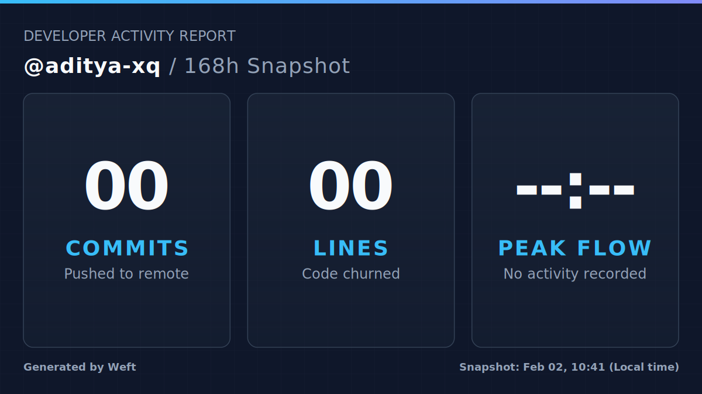

# Weft Quickstart Template



This repository is a **template** for setting up **Weft**, a GitHub Action that turns your GitHub activity into a visual summary and optionally publishes it to X (Twitter).

**What Weft does**

* Collects GitHub activity
* Renders a clean visual snapshot
* Publishes to X on a schedule or runs in preview mode

---

## Quickstart

| Step | Action                                              |
| ---- | --------------------------------------------------- |
| 1    | Click **Use this template** to create your repo     |
| 2    | Add required repository secrets                     |
| 3    | Enable GitHub Actions and edit `config/default.yml` |

Once enabled, the daily/weekly workflow runs automatically.

---

## Required secrets

Add these under **Repository Settings → Secrets → Actions**. You can get them from your [X developer portal dashboard](https://developer.x.com/en/portal/dashboard)

| Secret name         | Description                            |
| ------------------- | -------------------------------------- |
| `X_CONSUMER_KEY`    | X API consumer key                     |
| `X_CONSUMER_SECRET` | X API consumer secret                  |
| `X_ACCESS_TOKEN`    | X access token                         |
| `X_ACCESS_SECRET`   | X access secret                        |

**Preview only?**
Use `config/dry-run.yml`. It disables publishing.

---

## Workflows included

| File               | Purpose                                    |
| ------------------ | ------------------------------------------ |
| `daily-github.yml` | Scheduled daily run (03:30 UTC by default) |
| `manual-run.yml`   | Manual preview and debugging               |

By default, workflows use:

```yaml
uses: aditya-xq/weft@main
```

You can pin to a version tag when available.

---

## Configuration

Edit `config/default.yml`.

| Key                    | What to change            |
| ---------------------- | ------------------------- |
| `github.username`      | Your GitHub username      |
| `runtime.timezone`     | Your local timezone       |
| `time_window.duration` | Example: `24h`            |
| `visual.theme`         | Colors and layout         |
| `twitter.publish`      | Enable or disable posting |

Changes apply on the next run.

---

## Dry runs and previews

Two ways to preview without publishing:

1. Run **Manual / Preview: Weft** from the Actions tab
   Select `config/dry-run.yml`
2. Set `twitter.publish: false` in `config/default.yml`

Expected outputs:

* `out/summary.svg`
* `out/summary.png`

---

## Recommended usage

| Goal             | Recommendation           |
| ---------------- | ------------------------ |
| First-time setup | Start with `dry-run.yml` |
| Public posting   | Enable `twitter.publish` |
| Stability        | Pin to a tagged release  |
| Privacy          | Keep publishing disabled |

---

## Troubleshooting

If a run fails, check the following:

* All required secrets are present and valid
* `github.username` is correct
* The workflow logs in the Actions tab
* Run the manual preview workflow for isolation

Most failures are caused by missing secrets or incorrect usernames.

---

## Related project

This template uses the Weft action:

* [https://github.com/aditya-xq/weft](https://github.com/aditya-xq/weft)
